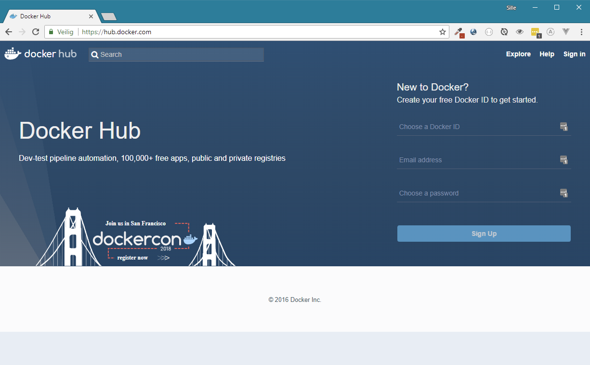
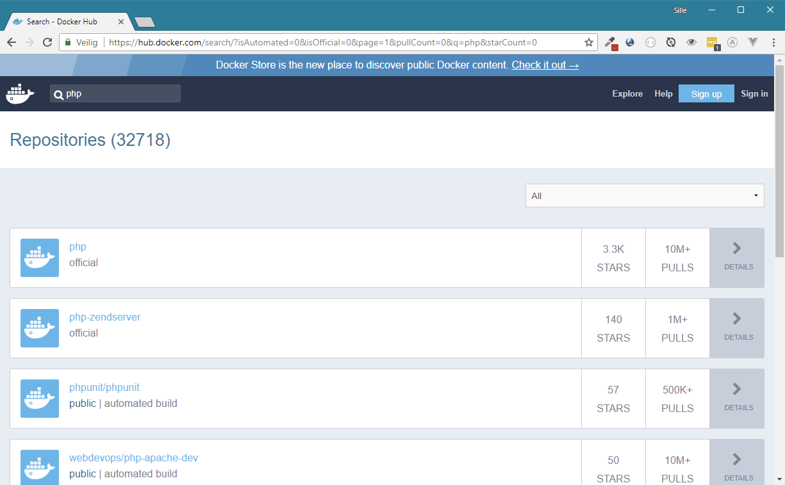
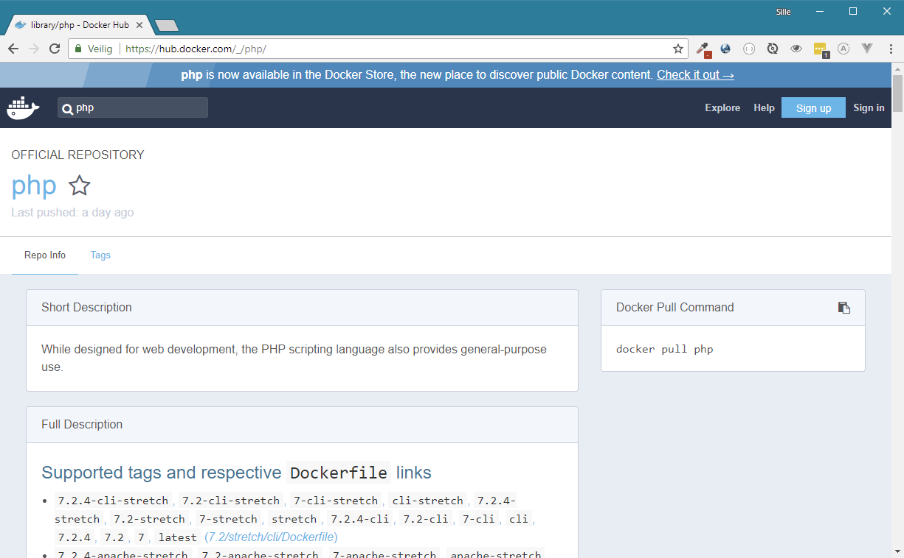

# Building containers

Lets create a `Dockerfile` in the project directory for our Hello World project. The Hello World application is written in the PHP programming language, so we will need an image that provides the PHP binaries. Next we also need an production grade HTTP server such as Apache to host the PHP files \(The `php -S` command that we used earlier is good for testing, but is cannot deliver the performance and features for real world applications\).

So we need the following dependencies inside our container:

* PHP binaries
* Apache HTTP server

We could create an Docker image from scratch, compiling, building, configuring and installing the dependencies by our self. This would be a tedious task, but is feasible. A better idea is to start 'from' an already built image that provides the dependencies. 

### Docker Hub

Docker Hub is a place that bundles existing Docker images, free and open for anybody to use. 

[https://hub.docker.com](https://hub.docker.com)



#### Finding a PHP image

Lets search for a fitting base image to build our image upon. Let's try to search for `PHP`

This should give us the following results:



Many image are available that provide support for PHP inside Docker. Many of them could be used. To make it easier to determine an active and supported image, Docker Hub will provide some extra information such as 'stars' and 'pulls'. People can 'star' images that they like. This will give an indication of the popularity. 'pulls' shows the amount of times that the images has been pulled, either to create an new image, or to deploy a container that is based on that image.

Another parameter that could help deciding what image to use is the developer. The developer is the first part before the `/` in the full container name. For example `webdevops/php-apache-dev` means that the image with name `php-apache-dev` is made by the `webdevops `developer or team.

Some image don't have a developer name and `/` sign. These images are 'official' images. They are created and maintained by the people of docker. They provide many of the popular solutions. Many times depending on one of these images is preferable. 

The best choice in our case would be the official `PHP `image. Lets click on it to see its details.



The PHP repository provides many variations of its images. Any variation can be chosen by using its 'tag'. This enables that you could depend on older versions, or have the cli variant for testing, or an Apache version for production. 

Note that you can always leave the tag empty. In that case Docker will use the default tag called `latest`.

Lets choose the latest version of PHP, and we also need Apache, so the `7.2-apache` tag would be useful for our application.

### `FROM`

Now that we found an image to depend on, lets add it to our `Dockerfile`. We can add this by using the FROM keyword followed by the name of the image, and the name of the tag we would like to start from. In our case this would result in 

```text
FROM php:7.2-apache
```

Now we have an Linux image with PHP and Apache installed.

### `COPY`

Next we need to copy our project files into the image. This can be done with the `COPY `keyword. The copy keyword accepts two arguments. The source of the files on our computer, and the destination in the Docker image.

Apache is by default configured to host files that are stored inside the `/var/www/html` directory. So we will need to copy the files from our project to that directory. This can be done with the following command.

```text
COPY . /var/www/html
```

Note that the `.` \(dot\) represents the current directory. So all files and folder that are in the same directory as the Dockerfile will be copied.

### `EXPOSE`

The goal of docker is to isolate software as much as possible. This means that TCP/IP traffic is unable to get in or out of the container. This can be solved by `EXPOSE`ing a TCP or UDP port. This will open up the port on the container, making communication with the outside world and vice versa possible.

Apache runs on port 80 to serve HTTP. This means that we need to open up this port in the container. This can be done with the following command:

```text
EXPOSE 80
```


### Dockerfile

This should be enough to run the Hello World application into a Docker container. The `Dockerfile`should look like this:

{% embed data="{\"url\":\"https://gist.github.com/sillevl/7bf84245ae48c611ea841fc573beb834\",\"type\":\"rich\",\"title\":\"Hello World Dockerfile\",\"description\":\"Hello World Dockerfile · GitHub\",\"icon\":{\"type\":\"icon\",\"url\":\"https://gist.github.com/fluidicon.png\",\"aspectRatio\":0},\"thumbnail\":{\"type\":\"thumbnail\",\"url\":\"https://avatars3.githubusercontent.com/u/979071?s=400&v=4\",\"width\":400,\"height\":400,\"aspectRatio\":1},\"embed\":{\"type\":\"reader\",\"html\":\"<script type=\\"text/javascript\\" src=\\"https://gist.github.com/7bf84245ae48c611ea841fc573beb834.js\\"></script>\",\"aspectRatio\":0}}" %}

### Building the image

The `Dockerfile `only describes how an image is created. The next step is to build the image. Building the image will execute the commands in the `Dockerfile`.  Building the image needs to be done with the `docker build` command in the terminal.

The docker build command needs some extra information to be able to build the image correctly.

The first argument is a tag. This can be provided with the `-t` or `--tag` attribute followed by the name of the tag. Lets tag our image with the name `hello-world`. The last attribute should be the directory where the `Dockerfile `is located. In our case this is the current directory and can be notated with a `.` \(dot\).

```bash
 docker build -t hello-world .
```

Many more attributes can be used. They are described in the Docker documentation.



Ok, lets run this command now. The result should look like this:

```text
$ docker build -t hello-world .
Sending build context to Docker daemon  3.072kB
Step 1/3 : FROM php:7.2-apache
7.2-apache: Pulling from library/php
2a72cbf407d6: Already exists
273cd543cb15: Already exists
ec5ac8875de7: Already exists
9106e19b56c1: Already exists
ee2f70ac7c7d: Pull complete
7257ad6985e8: Pull complete
18f5c2055da2: Pull complete
85293a6fdd80: Pull complete
9e797eeb0c14: Pull complete
f16178842884: Pull complete
13899c06d3f8: Pull complete
70c27fe4c3c5: Pull complete
e2267ec5c36e: Pull complete
322029cfc164: Pull complete
9482c722339b: Pull complete
Digest: sha256:a1dd126ffa530a70b80efae9fac2d18faf591a2a6f74841cc517a2168cde24f4
Status: Downloaded newer image for php:7.2-apache
 ---> ac8c4378955f
Step 2/3 : COPY . /var/www/html
 ---> b67f46c0f83e
Step 3/3 : EXPOSE 80
 ---> Running in 560b0e1a8cc8
 ---> 3a0867a3b241
Removing intermediate container 560b0e1a8cc8
Successfully built 3a0867a3b241
Successfully tagged hello-world:latest
SECURITY WARNING: You are building a Docker image from Windows against a non-Windows 
Docker host. All files and directories added to build context will have '-rwxr-xr-x' 
permissions. It is recommended to double check and reset permissions for sensitive 
files and directories.
```

First we can see that Docker will download \(pull\) the `php:7.2-apache` image from the internet. Next it will execute the commands provided in the `Dockerfile`. The result is a new images called `hello-world`.

### The `hello-world` image

You can list the installed images using the following command:

```text
docker images
```

This command will list all installed images on the computer. The `hello-world` image should be visible in that list.

```text
$ docker images
REPOSITORY        TAG         IMAGE ID            CREATED         SIZE
hello-world       latest      3a0867a3b241        8 minutes ago   412MB
```

You have now created your own custom Docker image. In the next chapter we will take a look on how to run this image and get the webpage visible in a browser.

