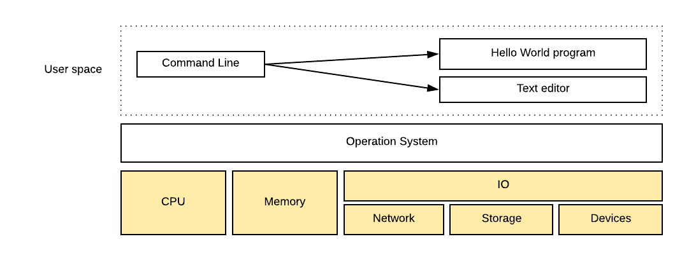
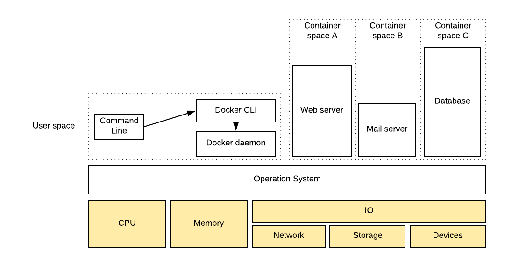
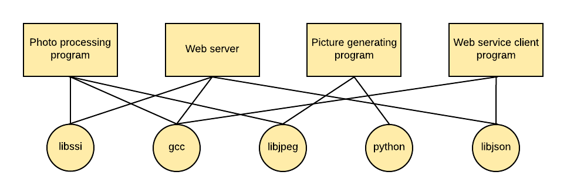

# Containers

A container is a running instance of an image. How images are built, is described using Dockerfiles. These files contain the steps needed to create the image. The images mainly contain the files that are needed to run the container. Additional information is provided such as what command to execute when starting the container.

An image is a template of a system you want to run. It isolates only the minimal and necessary applications and dependencies to run a particular application. The kernel is provided by the host system, and isolation is done using existing kernel features.

The image below shows a normal, non-containerized system. All application run in the user space memory of the system. Just like any other program that runs on top of an operating system.

In a containerized environment, only a limited docker cli and docker daemon run in user space. Any container running on the system runs in its own memory subspace of the user space. Programs inside the containers can only access their own memory and resources as scoped by the container.

### Getting organized

Normal applications share a lot of libraries and resources. This results in a tangled web of dependencies. Updating one application might result in breaking other applications. 

Docker untangles these dependencies by only providing the applications dependencies in a container. Updating a single container will never affect other containers. The only downside could be duplication of some libraries or resources. This aspect diminishes in respect to the advantages that containerization provides. 

The way that docker implements its images, also optimizes re-usability of common dependencies. This is due to the aspect that images are immutable. This results in the fact that many containers can depend on a single image, resulting in only a single need to store that image data. 

### Improving portability

Containers also solve the issue of portability. Due to the fact that all dependencies are bundled in the containers image, makes it very easy to distribute and deploy the software they contain.

