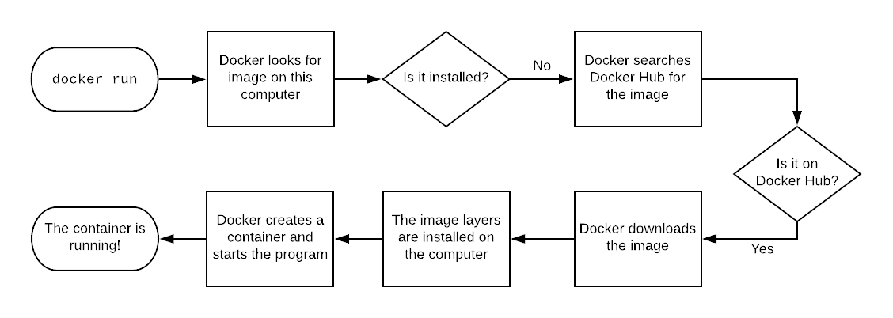
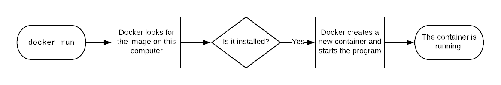

# Containers

Container is a running instance of an image 

an image is a template of an system you want to run.

it has the dependencies bundled inside the image to run the application

PICTURE???

Image contains

* OS
* Software
* Application code

