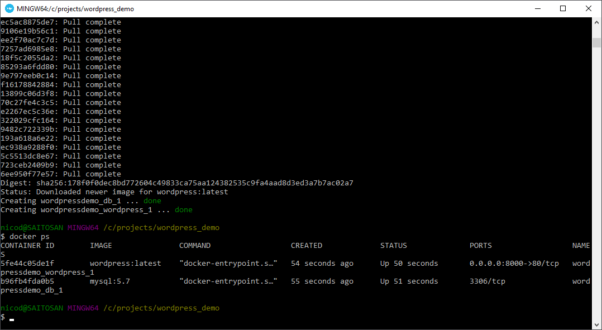
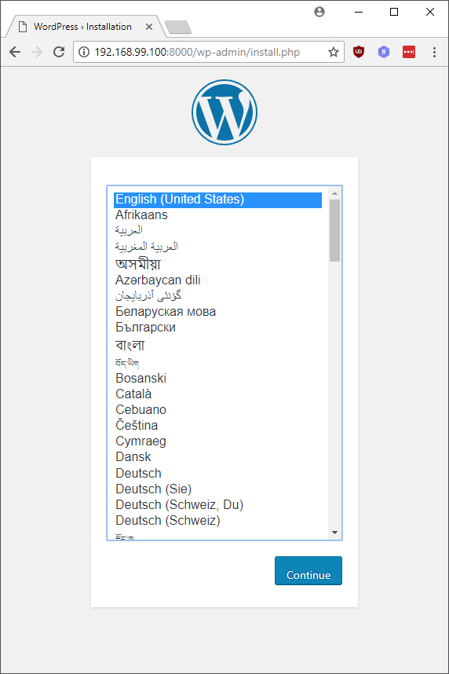

# Docker Compose

Docker Compose is a tool for defining and running multi-container Docker applications. With Compose, you use a YAML file to configure your application’s services. Then, with a single command, you create and start all the services from your configuration.

Let us demonstrate the power of compose by setting a WordPress blog website in a matter of minutes.

### Example - A WordPress blog

Start by creating a new project directory for your WordPress application.

```text
mkdir wordpress_demo
cd wordpress_demo
```

Now we need to create a `docker-compose.yml` file inside our project directory to define the different services that are required for our setup. A service exist of a container with its specific settings to run. Basically we define what images are required for our multi-container application. To run a Wordpress blog, we need both a mysql database server and a Wordpress image. Using the `depends_on` key it is possible to indicate that the Wordpress container requires a database container, this will result in first starting the database container, and then starting the Wordpress container to prevent problems.

Environment variables need to be used to configure both wordpress and mysql accounts.

```yaml
version: '3.3'

services:
   db:
     image: mysql:5.7
     volumes:
       - db_data:/var/lib/mysql
     restart: always
     environment:
       MYSQL_ROOT_PASSWORD: some_extra_secret_password
       MYSQL_DATABASE: wordpress
       MYSQL_USER: wordpress
       MYSQL_PASSWORD: this_should_be_secret

   wordpress:
     depends_on:
       - db
     image: wordpress:latest
     ports:
       - "8000:80"
     restart: always
     environment:
       WORDPRESS_DB_HOST: db:3306
       WORDPRESS_DB_USER: wordpress
       WORDPRESS_DB_PASSWORD: this_should_be_secret
volumes:
    db_data:
```


 Do note that the above username and passwords are used for demonstrational purposes only. A real production site should be authenticated using secure passwords.


### Build the project

Build the project by running `docker-compose up -d` inside your project directory.


`docker-compose `up without the `-d` option can also be used to spin up the services. The services will not be run in the background. Output of any of the containers will be shown in the terminal. Ending the terminal will also stop the containers from running.


This pulls the required Docker images, and starts the specified containers, as shown in the example below. You can verify that the containers are up an running by executing the `docker ps` command.



### WordPress configuration

At this point, WordPress should be running on port `8000` at  [http://192.168.99.100:8000](http://192.168.99.100:8000) and you can complete the “famous five-minute installation” as a WordPress administrator.


The WordPress site is not immediately available on port `8000` because the containers are still being initialized and may take a couple of minutes before the first load.




Now we should be good to go.


You can stop the multi-container project by issuing the command `docker-compose down` .  This command removes the containers and default network, but preserves your WordPress database.

A lot more information about Docker Compose can be found at [https://docs.docker.com/compose/](https://docs.docker.com/compose/)

