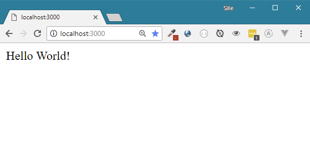

# Hello World app in PHP

Now that Docker is installed, lets create a small hello world application using PHP. We don't need PHP installed on the local machine to test and develop the application. All dependencies such as the PHP language, and an HTTP server will be managed inside the Docker container.

### Creating a PHP project

First we need a directory that will contain the project files. So lets start by creating an empty directory called `docker-hello-world-php`. Then, in this directory we can create a file called `index.php` and provide it with the following code:

```php
<?php

echo "Hello world!";
```

This is a minimal PHP  script that will show the text `Hello World!` in the browser.

#### Optional: Testing out our Hello World application

If you have PHP installed on your computer, you are able to test the application by running the following command in your command line. 

```bash
$ php -S localhost:3000
```

When surfing to[ http://localhost:3000](http://localhost:3000) in the brower you will be able to view the result if all goes well.



Now that we have confirmation that our script is working, lets continue and try to get everything in a Docker container.


