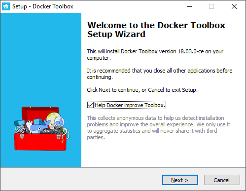
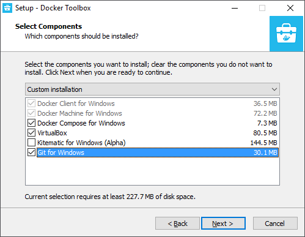
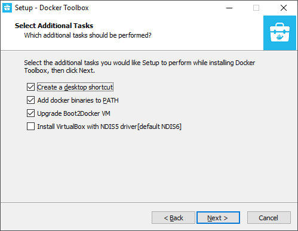
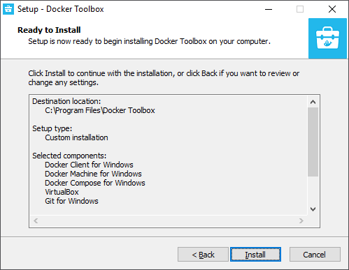
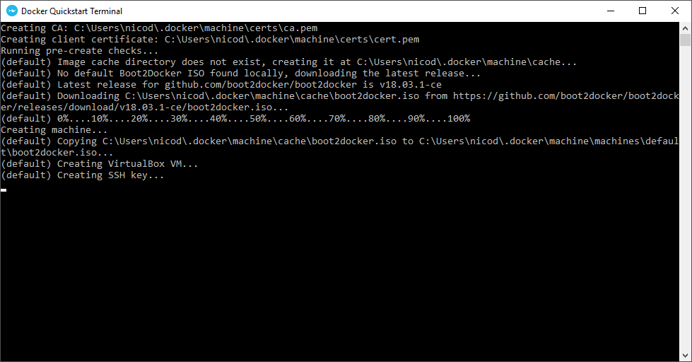
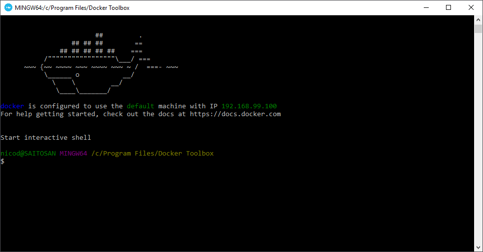

# Installation

Docker uses Linux-specific kernel features and therefore does not run natively on Windows. Docker Toolbox solves this by providing a command line interface to the docker engine running on a virtual machine equiped with a Linux kernel.

To use docker on Windows, download the Docker Toolbox at 

{% embed data="{\"url\":\"https://docs.docker.com/toolbox/toolbox\_install\_windows/\",\"type\":\"link\",\"title\":\"Install Docker Toolbox on Windows\",\"description\":\"How to install Toolbox on Mac\",\"icon\":{\"type\":\"icon\",\"url\":\"https://docs.docker.com/favicons/docs@2x.ico\",\"width\":129,\"height\":128,\"aspectRatio\":0.9922480620155039},\"thumbnail\":{\"type\":\"thumbnail\",\"url\":\"https://docs.docker.com/images/docs@2x.png\",\"width\":950,\"height\":500,\"aspectRatio\":0.5263157894736842},\"caption\":\"Download Docker Toolbox for Windows\"}" %}

### Steps to take

Make sure to select all components, only "Kitematic" is not required \(GUI\).

Next make sure to add docker binaries to your environment path.

Ready for installation

### Launching the CLI

To start using the Docker Toolbox find the "Docker QuickStart Terminal" and launch it.

The first time you run the terminal app it will setup a virtual machine and do some configurations.

Shortly after the CLI should become available.

