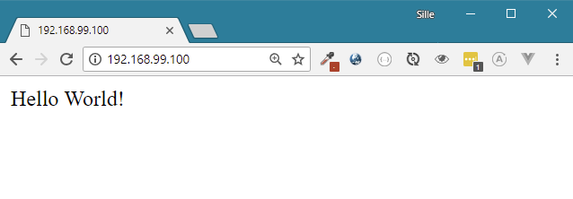

# Running containers

Running images with Docker can be done using the `Docker run` command. The command can take many attributes that give more information on how to run the container. 

To run the hello-world image that we created earlier, we can use the following command.

```bash
docker run -it -p 80:80 hello-world
```

The command tells to run the hello-world image and create a container. Next we need to tell that we also want the internal port 80 to be available on port 80 on the host machine, this can be done by using the `-p` flag. All traffic to port 80 of the Docker host will be forwarded to port 80 in the container. 

The `-it` flag will make sure the output of the Container is forwarded to our terminal. Terminating the terminal output will also result in terminating the container.

Other flags are documented in the Docker documentation:



Lets execute the command and check if everything is running.

The terminal will output the output of the container when running this command. It should look somethig

```text
$ docker run -p 80:80 hello-world
AH00558: apache2: Could not reliably determine the server's fully qualified 
domain name, using 172.17.0.3. Set the 'ServerName' directive globally to 
suppress this message
AH00558: apache2: Could not reliably determine the server's fully qualified 
domain name, using 172.17.0.3. Set the 'ServerName' directive globally to 
suppress this message
[Thu Apr 26 19:00:38.670160 2018] [mpm_prefork:notice] [pid 1] AH00163: 
Apache/2.4.25 (Debian) PHP/7.2.4 configured -- resuming normal operations
[Thu Apr 26 19:00:38.670527 2018] [core:notice] [pid 1] AH00094: Command 
line: 'apache2 -D FOREGROUND'
```

This is the normal output of the Apache application.

Lets start up a browser and surf to [http://192.168.99.100](http://192.168.99.100) If all goes well, we should be able to see the webpage. 



In the terminal we should also see the loggin informatin of Apache detecting our HTTP request and showing some information about that request:

```text
192.168.99.1 - - [26/Apr/2018:19:06:10 +0000] "GET / HTTP/1.1" 200 241 "-" 
  "Mozilla/5.0 (Windows NT 10.0; Win64; x64) AppleWebKit/537.36 (KHTML, like Gecko)
   Chrome/66.0.3359.117 Safari/537.36"
192.168.99.1 - - [26/Apr/2018:19:06:10 +0000] "GET /favicon.ico HTTP/1.1" 
   404 505 "http://192.168.99.100/" "Mozilla/5.0 (Windows NT 10.0; Win64; x64) 
   AppleWebKit/537.36 (KHTML, like Gecko) Chrome/66.0.3359.117 Safari/537.36"
```

### Running in the background

